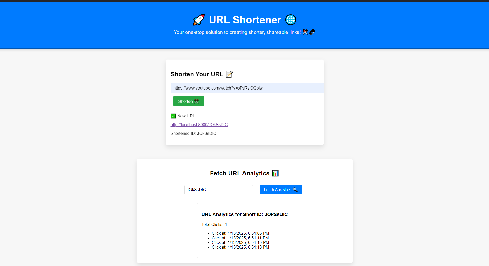
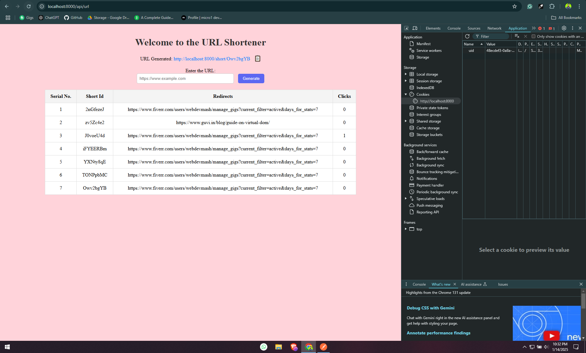

# 🚀 URL Shortener - Server-Side Rendered (SSR) with EJS 🌐


Welcome to the **URL Shortener** project, now built using **server-side rendering (SSR)** with **EJS** templates and enhanced authentication. This project allows users to shorten long URLs and track analytics for shortened links securely. Inspired by popular tools like **Bitly**, this app makes creating short, shareable URLs easy and efficient. ✂️🔗

## 🛠️ Project Overview

This URL Shortener app provides two main features:

1. **Shortening URLs** 📝
   - Users can enter long URLs, and the app will generate a short version of the URL.

2. **URL Analytics** 📊
   - Authenticated users can fetch analytics for any shortened URL by entering its unique short ID.

## 🏗️ Technologies Used

- **MongoDB** 🗄️ - NoSQL Database
- **Express.js** ⚡ - Web framework for Node.js
- **EJS** 📄 - Server-side templating engine for rendering HTML
- **Node.js** 🚀 - JavaScript runtime

## 🌟 Features

- Server-side rendered views with **EJS**
- Authentication for protected routes 🔒
- Generate short URLs instantly 🔗
- Track the number of clicks for each shortened URL 📊
- Built with love using JavaScript ❤️

## 📸 Screenshots

### Website Interface



### Analytics Feature

The analytics section allows authenticated users to track the clicks for a specific shortened URL:




## 💡 How to Use

1. **Shorten a URL**: 
   - Go to the main page, log in, enter the long URL, and click **Shorten ✂️**.
   - A short URL will be generated, and you can click on it to open the original link.

2. **Track Analytics**:
   - Enter the short ID of the URL you want to track in the **Fetch URL Analytics** section.
   - You'll see the total number of clicks and additional details.

3. **Authentication**:
   - Users must log in to access protected features such as URL shortening and analytics.

## 🖥️ Installation

To run this project locally, follow these steps:

1. Clone the repository:
   ```bash
   git clone https://github.com/your-username/url-shortener.git
   ```
2. Navigate into the project directory:
   ```bash
   cd url-shortener
   ```
3. Install dependencies:
   ```bash
   npm install
   ```
4. Set up environment variables in a `.env` file:
   ```
   DB_URI=your-database-uri
   SESSION_SECRET=your-session-secret
   ```
5. Start the application:
   ```bash
   npm start
   ```

The application will now be running on `http://localhost:8000`.

## Project Structure

```
url-shortener/
│
├── node_modules/        # Project dependencies (generated by npm)
├── public/              # Public assets (CSS, JavaScript, images)
├── views/               # EJS templates for server-side rendering
├── routes/              # API and page routes
├── controllers/         # Request handling logic
├── models/              # Database models
├── .env                 # Environment variables
├── .gitignore           # Git ignore file
├── package.json         # Project metadata and dependencies
└── README.md            # Project documentation (this file)
```

## License

This project is licensed under the MIT License - see the [LICENSE](LICENSE) file for details.
```
